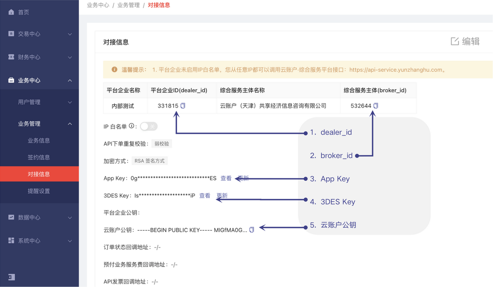
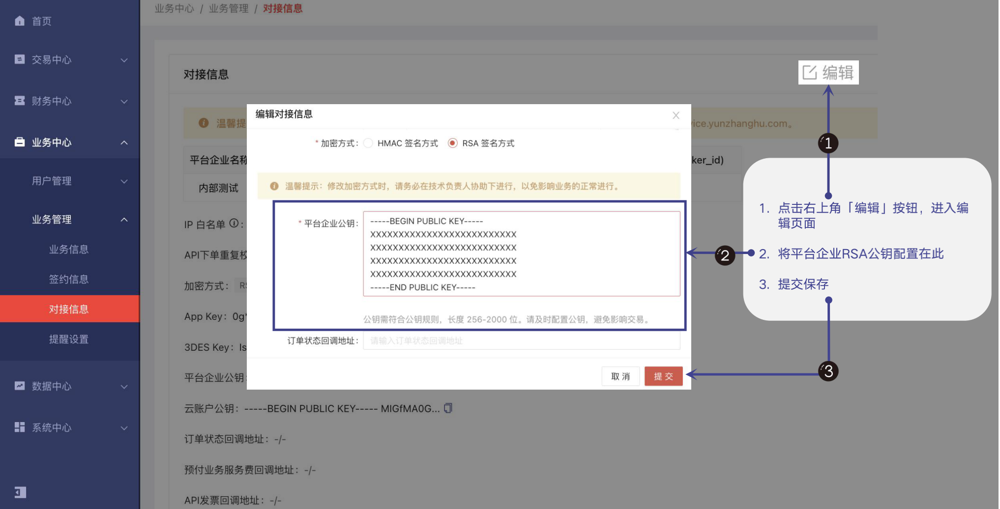

# 云账户 SDK for Golang

欢迎使用云账户 SDK for Golang。   
云账户是一家专注为平台企业和新就业形态劳动者提供高质量灵活就业服务的新时代企业。云账户 SDK 对云账户综合服务平台 API 接口进行封装，让您不必关心过多参数请求，帮助您快速接入到云账户综合服务平台。云账户 SDK for Golang 为您提供签约、下单、回调、数据查询等功能，帮助您完成与云账户综合服务平台的接口对接及业务开发。   
如果您在使用过程中遇到任何问题，欢迎在当前 GitHub 提交 Issues，或发送邮件至技术支持组 [techsupport@yunzhanghu.com](mailto:techsupport@yunzhanghu.com)。

## 环境要求

云账户 SDK for Golang 支持 Go 1.16 及其以上版本。


## 配置密钥
### 1、获取配置

使用云账户 SDK for Golang 前，您需先获取 dealer_id、broker_id、3DES Key、App Key 信息。   
获取方式：使用开户邮件中的账号登录[【云账户综合服务平台】](https://service.yunzhanghu.com)，选择“业务中心 > 业务管理 > 对接信息”，查看并获取以上配置信息。


### 2、生成密钥

- 方式一：使用 OpenSSL 生成 RSA 公私钥

```
① ⽣成私钥 private_key.pem

Openssl-> genrsa -out private_key.pem 2048   // 建议密钥⻓度⾄少为 2048 位

OpenSSL-> pkcs8 -topk8 -inform PEM -in private_key.pem -outform PEM -nocrypt -out private_key_pkcs8.pem    // 将私钥转为 PKCS8 格式 

② ⽣成公钥 pubkey.pem

Openssl-> rsa -in private_key.pem -pubout -out pubkey.pem
```

- 方式二：使用工具生成

请联系云账户技术支持获取 RSA 密钥生成工具

### 3、配置密钥

登录[【云账户综合服务平台】](https://service.yunzhanghu.com)，选择"业务中心 > 业务管理 > 对接信息"，单击页面右上角的"编辑"，配置平台企业公钥。



## 安装 Golang SDK
### 1、使用 go module 安装 SDK

```
go get github.com/YunzhanghuOpen/sdk-go
```

## 快速使用

### 示例功能列表

- [H5 签约](example/h5usersign/h5usersign.go) or [API 签约](example/apiusersign/apiusersign.go)
- [实时下单接口](example/payment/payment.go)
- [订单异步回调](example/payment/payment.go)
- [数据接口](example/dataservice/dataservice.go)
- [发票接口](example/invoice/invoice.go)
- [个税扣缴明细表下载接口](example/tax/tax.go)
- [用户信息验证接口](example/authentication/authentication.go)


### 示例
```golang
package main

import (
	"context"
	"fmt"
	"math/rand"
	"net/http"
	"time"

	"github.com/YunzhanghuOpen/sdk-go/api"
	"github.com/YunzhanghuOpen/sdk-go/core"
	"github.com/YunzhanghuOpen/sdk-go/errorx"
)

func main() {
	// 请求返回打印中间件
	logMiddle := func(next core.Handler) core.Handler {
		return func(ctx context.Context, req interface{}) (interface{}, error) {
			fmt.Println("middleware begin ", "requestID=", core.RequestID(ctx), " req=", req)
			resp, err := next(ctx, req)
			fmt.Println("middleware done  ", "requestID=", core.RequestID(ctx), " resp=", resp)
			return resp, err
		}
	}

	// requestID 注入中间件
	requestIDMiddle := func(next core.Handler) core.Handler {
		return func(ctx context.Context, req interface{}) (interface{}, error) {
			return next(core.WithRequestID(ctx, fmt.Sprint(rand.Int63())), req)
		}
	}

	_ = requestIDMiddle
	dealerID := "云账户对接信息中申请的平台企业 ID"
	privateKey := "在云账户配置的公钥对应的私钥"
	appKey := "云账户对接信息中申请的 App Key"
	des3Key := "云账户对接信息中申请的 3DES Key"
	conf := &api.Config{
		Host:       api.ProductHost, // 正式环境域名，开发自测时可使用沙箱环境地址 api.SandboxHost
		DealerID:   dealerID,
		PrivateKey: privateKey,
		AppKey:     appKey,
		Des3Key:    des3Key,
	}

	client, err := api.New(conf,
		core.WithHttpClient(&http.Client{}),
		core.WithMiddleware(logMiddle),
		core.EnDebug(), // 测试时可开启，上线时可关闭
	)
	if err != nil {
		return
	}

	brokerID := "云账户对接信息中申请的综合服务主体 ID"
	orderID := time.Now().Format("20050102150405") // 订单号应由发号器生成，保证全局唯一，此处简写
	req := &api.CreateBankpayOrderRequest{
		BrokerID:  brokerID,
		DealerID:  dealerID,
		OrderID:   orderID,
		RealName:  "张三",
		IDCard:    "120000000000000000",
		CardNo:    "1111111111111111111111111",
		PayRemark: "银行卡支付",
		NotifyURL: "https://wwww.callback.com", // 需填写自己实现的回调接口
		Pay:       "99.99",
	}

	requestID := fmt.Sprint(rand.Int63()) // 此处必需注入 requestID，便于问题发现及排查，也可以使用 requestIDMiddle 中间件实现
	resp, err := client.CreateBankpayOrder(core.WithRequestID(context.TODO(), requestID), req)
	if err != nil {
		e, ok := errorx.FromError(err) // 解析配置
		if !ok {
			// 可能是 SDK 内部错误或网络错误，请求未能连接到服务器
			// 也可能是服务端请求超时，需原单号重试
			return
		}
		if e.Code == "2002" {
			// 订单号重复
			// 检查是否已存在该订单号
			// TODO 异常处理流程

		} else {
			// 下单异常
			// 其它错误码详见接口文档附录中响应码列表
		}
		return
	}

	// TODO 处理返回
}
```
